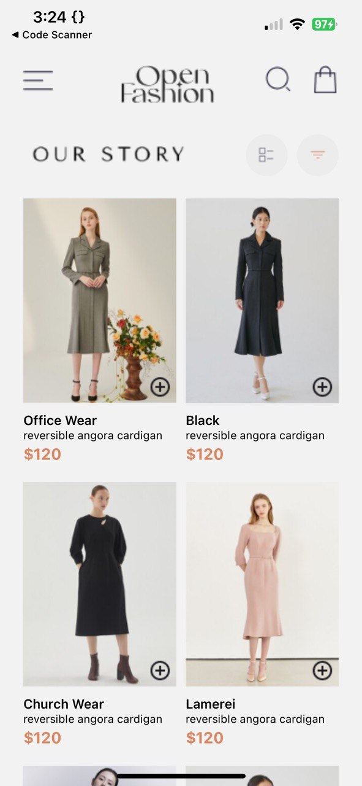
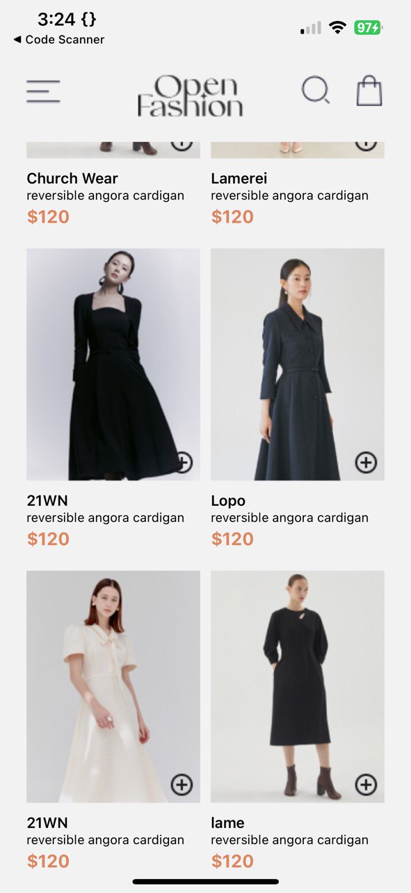
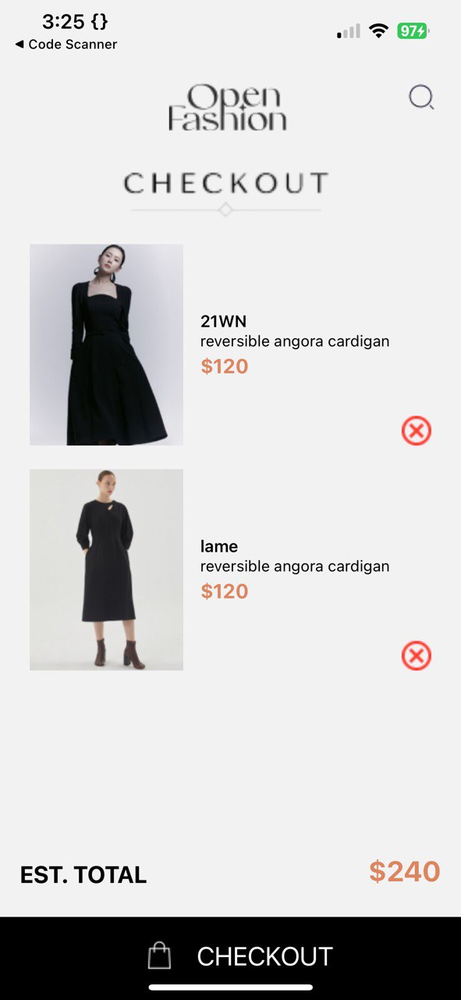

# STUDENT ID: 11024275

## HOMESCREEN

## CART SCREEN

## Data Storage

### Saving Data (Adding to Cart)

- In the Home.js file, when a user adds a product to the cart, the addToCart function is called.

- This function retrieves the current cart items from AsyncStorage, adds the new item, and then saves the updated cart back to AsyncStorage.

### Loading Data (Fetching Cart Items)

- In the Cart.js file, when the cart screen loads, the fetchCartItems function is called inside useEffect.

- This function retrieves the cart items from AsyncStorage and updates the state with these items.

### Updating Data (Removing from Cart)

- In the Cart.js file, the removeFromCart function allows users to remove items from the cart.

- This function filters out the item to be removed, updates the state, and saves the updated cart back to AsyncStorage.
